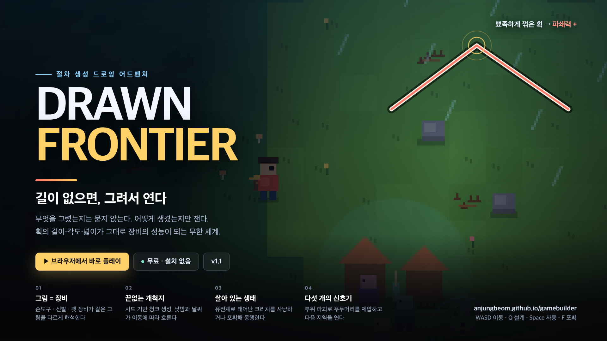

<p align="center">
  
</p>

<h1 align="center">Drawn Frontier</h1>
<p align="center"><b>그림으로 도구를 만들고 개척하기! ✨</b></p>

<p align="center">
  <a href="https://anjungbeom.github.io/gamebuilder/"><b>▶ 브라우저에서 바로 플레이</b></a>
  &nbsp;·&nbsp; 무료 &nbsp;·&nbsp; 설치·로그인 없음 &nbsp;·&nbsp; v1.2.0
</p>

---

그림으로 **도구**를 만들고 **개척**하기! ✨

화면에 그은 획의 길이, 꺾인 각도, 감싼 넓이, 갈래의 수가 그대로 장비의 성능이 되는 절차 생성 도트 탐험 게임.
일정 크기의 랜덤 맵을 모두 개척하는 것이 목표!

## 플레이

| | |
|---|---|
| 플레이 | <https://anjungbeom.github.io/gamebuilder/> |
| 플랫폼 | 브라우저 (Chrome · Edge · Safari · Firefox) · 데스크톱 키보드, 모바일 터치 조작 |
| 가격 | 무료 |
| 언어 | 한국어 |
| 한 판 길이 | 10–30분 |
| 같은 세계 다시 보기 | 주소 뒤에 `?seed=1234` |

## 게임소개

**그린 것이 곧 장비.**
도구를 이름으로 맞히는 게임이 아니다. 그림의 기하학이 곧 수치다.

| 이렇게 그리면 | 이 능력이 오른다 | 무엇을 재는가 |
|---|---|---|
| 길게 뻗어서 | 사거리 | 가장 멀리 떨어진 두 점 사이 거리 |
| 뾰족하게 꺾어서 | 파쇄력 | 가장 날카롭게 꺾인 꼭짓점의 각도 |
| 닫아서 | 부력 | 닫힌 획이 감싼 넓이 |
| 획을 여러 개로 | 포획력 | 자유롭게 열린 끝의 개수 |
| 많이 그려서 | 내구도 | 획의 총 길이 |

같은 그림도 장착 칸에 따라 다르게 읽힌다. 손도구는 파쇄형·장대형·방벽형·포획형·균형형으로 갈리고,
신발은 달리기·안정성·내구도·잉크 절약으로, 펫 도구는 공격력·지원거리·생존력·제압력으로 번역된다.

**매번 새로 펼쳐지는 개척지, 끝이 있는 땅.**
시드와 좌표로 생성되는 지형 위에 고도·습도 노이즈가 바이옴을 만들고, 그중 반지름 150칸이 이번 원정의 전부다.
같은 시드는 언제나 같은 세계다. 낮과 밤, 비와 안개는 실제 대기 시간이 아니라 걸어온 거리에 따라 흐르고,
체온과 소음이 이동 속도와 크리처의 탐지 거리를 바꾼다.

**개척률 100%가 진짜 끝.**
경계 안의 땅은 8×8칸짜리 구역으로 나뉘고, 가까이 다가가면 그 구역이 열린다.
분모는 시작점에서 걸어 닿을 수 있는 구역만 세므로 100%는 언제나 도달할 수 있다.
잠긴 지역은 신호기를 켜기 전까지 개척률에 들어오지 않고,
신호기 다섯 개를 모두 켜고 개척률이 100%가 되는 순간 원정이 끝난다.
`M` 지도는 원정 전체를 한 화면에 보여 주고, 나침반은 남은 미개척 구역 방향을 가리킨다.

**살아 있는 생태.**
크리처는 유전체에서 몸이 조립되고, 바이옴에 맞춰 형태와 능력이 달라진다.
붉은 `!` 표식은 추적해 오는 적대종, 민트색은 도망치는 온순종.
약하게 만든 뒤 포획해 동행시키거나, 끝까지 싸워 처치 보상을 얻는다.

**다섯 개의 신호기, 다섯 번의 결전.**
각 지역의 신호기는 연결 부위를 가진 우두머리가 지킨다.
이동 봉인 → 투사 기관 → 기동 기관 순으로 빛나는 부위를 부수면 추적과 사격이 차례로 끊기고,
완전히 제압된 뒤에야 표시된 방향에서 본체 약점을 칠 수 있다.

## 플레이 루프

1. 절차 생성된 세계를 걷는다.
2. 바위·덤불·가시덩굴·거목·산비탈·물에 막힌다.
3. `Q`를 눌러 지금 필요한 성질을 가진 도구를 그린다.
4. 도구로 길을 열고 내구도와 잉크를 소모한다.
5. 신호기와 마을을 찾아 지역을 열고, 크리처와 우두머리를 상대한다.
6. 기술 조각으로 탐사 등급을 올려 점프·와이어·반사 방벽을 해금한다.
7. 남은 미개척 구역을 지도에서 확인하고 경계 끝까지 걸어 개척률을 100%로 만든다.

## 조작

| 입력 | 기능 |
|---|---|
| `WASD` / 방향키 | 8방향 이동 |
| `Shift` | 달리기 |
| `Q` | 손도구 설계 |
| `Space` | 바라보는 방향의 장애물 제거 · 적대 크리처 공격 |
| `T` | 장착 도구를 일회성으로 투척 · 락온 중에는 대상 방향, 아닐 때는 바라보는 방향 · 충돌 후 파괴 |
| `P` | 패링 — 투사체 반사, 근접 크리처 무장해제 |
| `/` | 최근 이동 모멘텀 방향으로 회피 · 락온 중 대상에게 가까워지는 방향 차단 · 신발에 따라 거리 증가 |
| `L` | 가장 가까운 상대 조준 락온 · 이동 방향과 시선 분리 · 다시 누르면 다음 상대 |
| `F` | 약해진 적대 크리처 포획 · 온순한 크리처 길들이기 |
| `Tab` | 장비 · 수집품 · 동행 펫 |
| `V` | 다음 도전과제와 보상 |
| `M` | 개척 지도 — 원정 전체와 남은 미개척 구역 |
| `C` | 크리처 도감 |
| `↑` · `E` · `R` | 해금 후 점프 · 와이어 · 반사 방벽 |
| 환경설정 | 모든 키 재설정 · 제한된 애니메이션 · 저장 캐시 초기화 |

터치 화면에서는 화면 아래 조작판이 자동으로 열린다.
왼쪽 스틱으로 8방향 이동하고 끝까지 밀면 달린다. 오른쪽 버튼은 사용·설계·포획·가방·지도다.
OS의 '동작 줄이기' 설정을 켜 두었다면 애니메이션은 처음부터 제한 모드로 시작한다.

## 3분 만에 감 잡기

1. 새 원정을 시작하고 나침반이 가리키는 가장 가까운 신호기 방향을 본다.
2. `Q`로 길고 뾰족한 획을 긋는다. 그리는 동안 도구 성질을 직관적인 색과 아이콘으로 미리 본다.
3. 가까운 바위나 수풀 앞에서 `Space`로 길을 연다.
4. 붉은 크리처를 `Space`로 약하게 만든 뒤 `F`로 포획해 동행시킨다.
5. `Tab`에서 신발을 그려 신고 `Shift`로 달린다. 속도와 수명은 맞바꾼다.
6. `M`으로 개척 지도를 열어 밝힌 땅과 남은 땅을 확인한다.

## 로컬에서 실행

의존성 없는 ES 모듈 프로젝트다. 모듈 로딩 때문에 HTML을 직접 열지 말고 로컬 서버를 쓴다.

```bash
python3 -m http.server 4173 --bind 127.0.0.1
```

`http://127.0.0.1:4173/`을 연다. 테스트는 다음과 같이 실행한다.

```bash
npm test
```

## 구조

```text
src/
  rng.js         해시 · PRNG · value noise · fbm
  geometry.js    획을 도구 능력치로 변환
  world.js       바이옴 · 장애물 · 표석 · 크리처 서식 · 원정 경계 · 개척 격자 · 타일 캐시
  creature.js    유전체에서 몸 설계 생성
  behavior.js    크리처 · 주민의 보상함수와 행동 선택
  combat.js      공격 · 패링 · 부위 파괴 판정
  progression.js 탐사 등급 · 기술 조각 · 해금
  challenges.js  다음 도전과제 · 완료 해금 · 순환 팁
  equipment.js   장비 유형 · 슬롯별 성능 변환
  environment.js 이동 거리 기반 낮밤 · 날씨 · 체온 · 소음
  settings.js    옵션 · 저장
  render.js      캔버스 도트 렌더링
  game.js        상태 기계 · 입력(키보드·터치) · 시뮬레이션 · 개척률 · 저장
tests/           node --test 기반 로직 · 부팅 · 제출물 검증
```

## 만든 사람

anjungbeom(yongmaengee), parkjungg · [저장소](https://github.com/anjungbeom/gamebuilder)

설계 배경과 제출 문서는 [`FRONTIER-README.md`](FRONTIER-README.md)와 [`submission/`](submission)에 있음.
